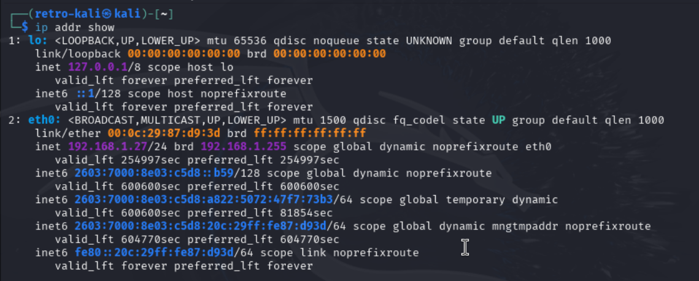
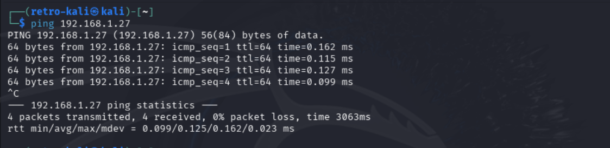
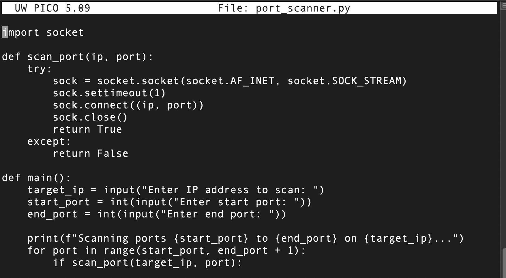
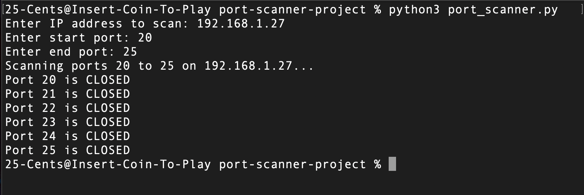
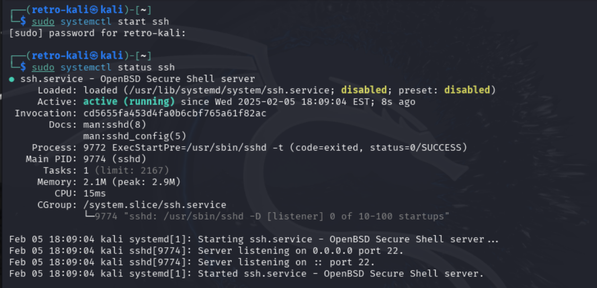
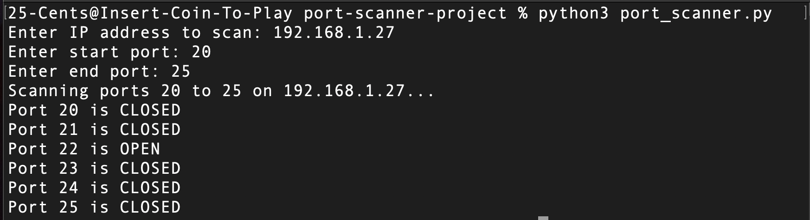

# Port Scanner Project

A beginner-friendly Python script for scanning ports on a specified IP address.  
This project demonstrates basic cybersecurity and network concepts, such as  
TCP connections and port discovery.

---

## Description

This **port scanner** allows you to:
- Input a target IP or hostname.
- Specify a range of ports to scan.
- Determine which ports are open or closed by attempting TCP connections on each port.

**Why is this useful?**  
Port scanning is a fundamental step in network reconnaissance for both ethical hacking and security assessments. By knowing which ports are open on a system, you can identify potential attack vectors or services running on those ports.

---

## Requirements

- **Python 3.x** installed on your system.
- Basic understanding of networking concepts is helpful, but not mandatory.

---

## How to Use

1. **Clone the Repository**  
   ```bash
   git clone https://github.com/chetflowers/Port-Scanner-Project-with-Kali-and-Python.git
   cd port-scanner-project

2. **Run the Script**
- python3 port_scanner.py
- When prompted, enter the target IP address (e.g., 192.168.1.27)
- Then provide the starting and ending port numbers (e.g., 20 to 25)

3. **Observe the Output**
- The script will print whether each port in the specified range is OPEN or CLOSED.

## Screenshots

1. The "ip addr show" command to verify the target machine's ip address.


2. The ping command verifying the connection between host and target machines


3. Port scanner Python script.


4. First run and ouput of script.


5. Starting SSH to open port 22


6. Second run and output of script.


## Notes

- Ethical Use Only: Please use this tool responsibly. Scanning ports without
permission may violate laws or terms of service.
- If you want to experiment further, you can enable various network services on your
target machine (e.g., SSH, FTP, HTTP) and watch the scanner detect those open ports.
- You can enhance the script by adding:
- Multithreading for faster scans.
- Banner Grabbing to identify which services are running on open ports.
- Command-Line Arguments instead of interactive inputs.

## Contributing

Contributions are welcome! Feel free to open an issue or submit a pull request.

## License

This project is licensed under the MIT License, or whichever license you choose.
Please see the LICENSE file for more details.


## Contact

Author: Chet Flowers
GitHub: chetflowers
